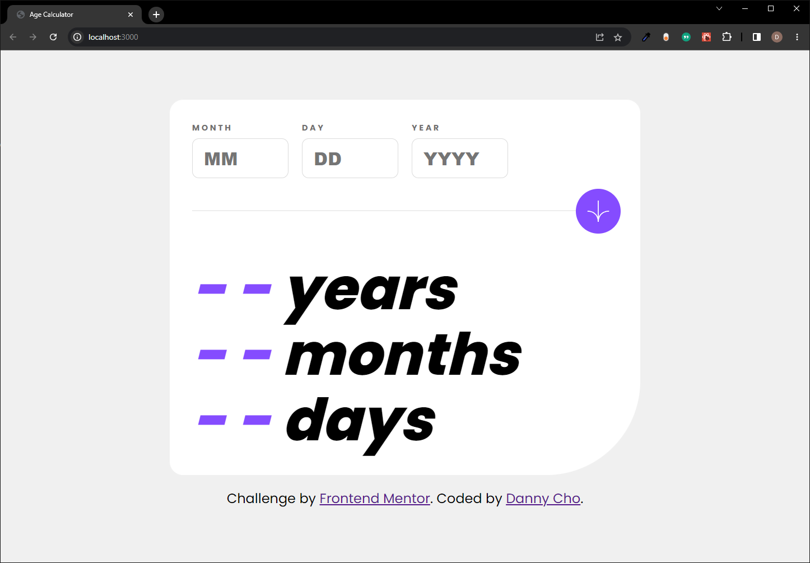
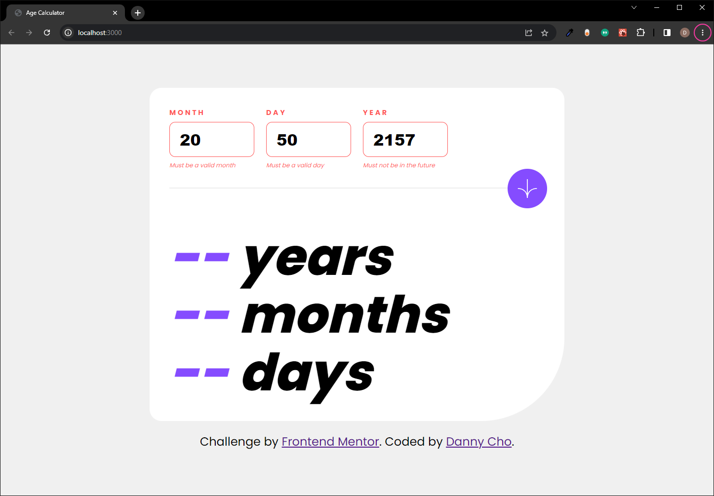
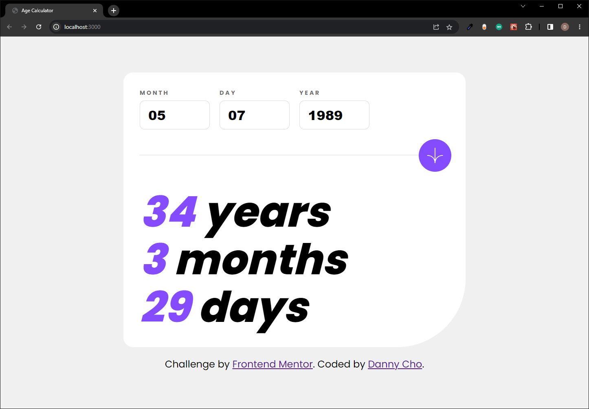
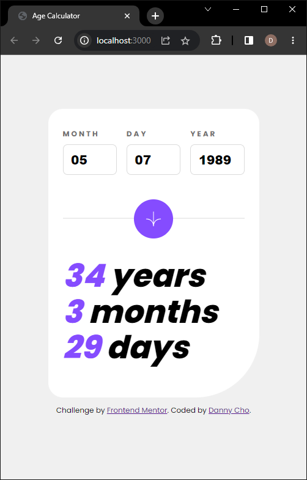

# Frontend Mentor - Age calculator app solution

This is a solution to the [Age calculator app challenge on Frontend Mentor](https://www.frontendmentor.io/challenges/age-calculator-app-dF9DFFpj-Q). Frontend Mentor challenges help you improve your coding skills by building realistic projects. 

## Table of contents

- [Frontend Mentor - Age calculator app solution](#frontend-mentor---age-calculator-app-solution)
  - [Table of contents](#table-of-contents)
  - [Overview](#overview)
    - [The challenge](#the-challenge)
    - [Screenshot](#screenshot)
    - [Links](#links)
  - [My process](#my-process)
    - [Built with](#built-with)
    - [What I learned](#what-i-learned)
    - [Continued development](#continued-development)

## Overview

### The challenge

Users should be able to:

- View an age in years, months, and days after submitting a valid date through the form
- Receive validation errors if:
  - Any field is empty when the form is submitted
  - The day number is not between 1-31
  - The month number is not between 1-12
  - The year is in the future
  - The date is invalid e.g. 31/04/1991 (there are 30 days in April)
- View the optimal layout for the interface depending on their device's screen size
- See hover and focus states for all interactive elements on the page
- **Bonus**: See the age numbers animate to their final number when the form is submitted

### Screenshot







### Links

- [Solution URL](https://github.com/danheecho1/FEM_age-calculator-app)
- [Live Site URL](https://fem-age-calculator-app-nu.vercel.app/)

## My process

### Built with

- HTML
- CSS
- React with TypeScript and Next.js


### What I learned

1. In React, it is generally not a good idea to manipulate DOM using document.querySelector. Instead, using useRef() is recommended. 
  - React's workflow is as below: 
    - React works with a virtual DOM, which is a lightweight copy of the actual DOM. 
    - When there are changes to virtual DOM (state, prop, etc), React compares the new virtual DOM against the previous virtual DOM. This process is called reconciliation. 
    - Then, React calculates the difference between the two virtual DOMs. This process is called diffing.  
    - Once React is done with diffing, it calculates the minimum changes required to update the actual DOM rather than re-rendering the entire DOM. 

  - If we use document.querySelector() and such, we change the actual DOM and mess up React's reconciliation process. It is best to use useRef, useState, and props unless absolutely necessary(?)

2. When adding className via DOM manipulation (i.e. classList.add/toggle) **and the stylesheet is imported as a module**, you still have to specify 'styles'. 

```js
const chosenElement = useRef(null);
chosenElement.current?.classList.add(styles["newStyleName"]);
```

### Continued development

This was my first project using TypeScript. I thought I'd learn as I go because I felt like I knew enough of JavaScript. As I started writing the logics for calculating age and validating user input, I realized how much I relied on JavaScript's leniency and how many lines of 'working' codes I wrote without understanding why they technically shouldn't. TypeScript for React is probably an additional layer on top of just TypeScript, but it's been fun. Moving forward, I'll stop using JavaScript and continue to learn TypeScript hands on. 

Also, I got to try a little bit of SASS on the side (SCSS, but not on this project). I definitely don't like the idea of having .scss and .css both in the project (at least Next.js handles that issue for TypeScript by default), but it makes organization much easier. SCSS is also on my list of 'moving forward, use this' list. 

Lastly, I started reading 'Refactoring' by Martin Fowler. I thought this book wouldn't apply to a frontend developer like me, but this project changed my mind. My page.tsx **sucks**. React and Next.js pushes the boundaries of frontend development quite a bit; I can't be focused only on writing HTML and CSS. I will be coming back to this project as I read more so that I can refactor the messy logics I've written. 

